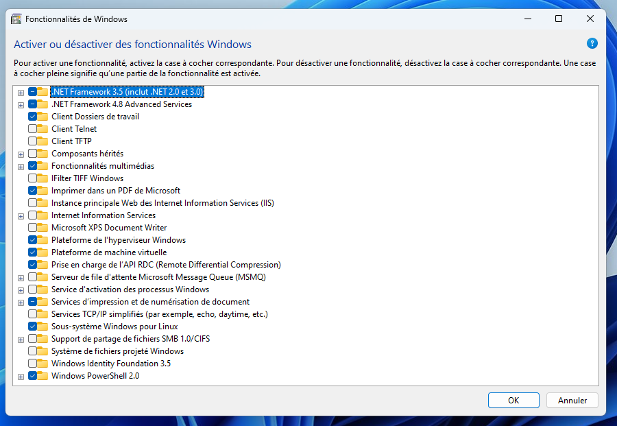

# Développement natif - Démonstration 1 : développer un programme *natif* en C, fiche de suivi

Dans cette démonstration, nous allons compiler du code source C vers un binaire executable par l'OS. Nous allons voir en détail les différentes étapes de la compilation.

- [Développement natif - Démonstration 1 : développer un programme *natif* en C, fiche de suivi](#développement-natif---démonstration-1--développer-un-programme-natif-en-c-fiche-de-suivi)
  - [Objectifs](#objectifs)
  - [Pré-requis](#pré-requis)
    - [Sous Gnu/Linux (Debian, Ubuntu)](#sous-gnulinux-debian-ubuntu)
    - [Sous Windows](#sous-windows)
  - [Compiler du code source C vers du langage machine (binaire)](#compiler-du-code-source-c-vers-du-langage-machine-binaire)
    - [Compilation](#compilation)
    - [Assemblage](#assemblage)
    - [Linkage (Édition des liens)](#linkage-édition-des-liens)
    - [Executer](#executer)
  - [Bonus : scripter le processus de compilation avec `make`](#bonus--scripter-le-processus-de-compilation-avec-make)
    - [Présentation de `make`](#présentation-de-make)
    - [Pratique](#pratique)
  - [Conclusion](#conclusion)
  - [Annexes](#annexes)
    - [WSL : Erreurs rencontrées et configuration de Windows](#wsl--erreurs-rencontrées-et-configuration-de-windows)

## Objectifs

- Comprendre le processus de compilation
- Comprendre que la compilation vise une plateforme spécifique

## Pré-requis

### Sous Gnu/Linux (Debian, Ubuntu)

Installer le compilateur gcc 

~~~bash
sudo apt install gcc
~~~

### Sous Windows

[Installer WSL 2](https://learn.microsoft.com/fr-fr/windows/wsl/install) pour accéder à un environnement GNU/Linux (Ubuntu par défaut) sur votre machine.

<!-- 
Windows Subsystem for Linux (WSL) est un composant de Microsoft Windows permettant d'exécuter des binaires Linux de manière native sur Windows 10, 11 et Windows Server 2019. Les exécutables Linux sont au format ELF, format popularisé par l'Unix System Laboratories, un laboratoire de recherche appartenant à AT&T, la grande entreprise des télécoms américaine, célèbre notamment pour son laboratoire Bells Labs, dont UNIX est sorti à la fin des années 70. Ce composant a été intégré à Windows en 2016, et a été remplacé en 2019 par WSL 2, une version basée sur une machine virtuelle plus légère. WSL2 embarque directement le noyau Linux et offre de meilleures performances, plus proche d'un Linux natif, que son prédécesseur.

La WSL 2 offre une interface vers un environnement GNU/Linux où l'utilisateur peut exécuter un shell Bash, ainsi que de célèbres programmes en ligne de commande GNU/Linux comme awk, sed, grep, etc.

Cette couche applicative intégrée à Windows vous permet donc d'accéder facilement à un écosystème Linux sur votre machine, sans avoir à installer ou configurer de machines virtuelles gourmandes en ressources, ou à installer un dual boot.
 -->

Pour télécharger et installer WSL 2, vous pouvez vous rendre sur [la page officielle de Microsoft](https://learn.microsoft.com/fr-fr/windows/wsl/install) et suivre les instructions.

Ouvrez une Invite de commandes en mode administrateur en cliquant avec le bouton droit et en sélectionnant `"Exécuter en tant qu'administrateur"`

~~~bash
wsl --install
wsl --update
~~~

<!-- 
Ce programme active les fonctionnalités nécessaires pour exécuter la WSL, télécharge et installe le dernier noyau Linux, définit WSL 2 comme valeur par défaut et télécharge la distribution Ubuntu. Si WSL est déjà installé, le programme wsl vous l'indique et vous demande de choisir la distribution à servir, vous avez le choix entre plusieurs distributions GNU/Linux comme Ubuntu, Debian ou openSUSE. Pour installer Ubuntu :
 -->

En cas de problèmes avec WSL, [reportez-vous à cette section](#wsl--erreurs-rencontrées-et-configuration-de-windows).

Ouvrir la WSL. Choisissez un nom d'utilisateur et un mot de passe pour le système GNU/Linux. Cet utilisateur est l'administrateur du système avec la capacité d'exécuter des commandes d'administration (`sudo`). WSL va vous ouvrir un *shell* sur votre instance GNU/Linux. Executer les commandes suivantes :

~~~bash
#Mettre à jour la liste des paquets
sudo apt update
#Mettre à jour les paquets
sudo apt upgrade
#Installer gcc
sudo apt install gcc
# Tester
gcc --version
~~~

Vous avez à présent accès à une distribution GNU/Linux via la WSL et installé le compilateur `gcc`.

## Compiler du code source C vers du langage machine (binaire)

**Créer un dossier** `demo-compilation`.

**Créer un fichier source** `main.c`.

~~~C
#include<stdio.h>

int main(){
    printf("Hello world !");
    return 0;
}
~~~

<!-- 
Ici on include le header stdio.h qui est une librairie permettant de gérer la sortie standard et définissant printf. Ca fait partie du SDK de GNU/Linux ! On reviendra plus en détails sur ces aspects dans la deuxième démo.
 -->

**Construire l'executable** à partir du code source pour la plateforme GNU/Linux en passant vers les différentes étapes de la "compilation" (*build*) :

1. Compilation
2. Assemblage
3. Linkage

> Regardez les différentes options de `gcc` avec l'option `--help`. Par défaut, gcc effectue toutes les étapes de la compilation en une fois. `gcc main.c` compile, assemble et link pour produire l'executable `a.out`

### Compilation

~~~bash
gcc -S main.c
~~~

Cela crée un fichier en langage assembleur `main.s`

> Inspecter le fichier assembleur `main.s`

<!-- 
Dans l'assembleur, il y a encore des références aux fonctions de la lib standard.
 -->

### Assemblage

~~~bash
gcc -c main.s
~~~

Cela crée un fichier objet (executable au format ELF) `main.o`.

**Inspecter** le contenu du fichier `main.o` (`cat main.o`). Qu'est ce qui s'affiche ? Pourquoi ?

> Sous le capot, `gcc` utilise l'assembleur `as`

<!-- 
A l'assemblage, le langage assembleur est transformé en binaire. Cela produit un fichier objet .o, qui contient encore les refs vers les fonctions de la libraire standard incluse (deps).
 -->

### Linkage (Édition des liens)

`main.o` est un binaire intermédiaire, qui n'est pas encore exécutable. Il contient des références (symboles) vers les fonctions de la librairie standard utilisées par le programme (ici `printf`). Pour indiquer où trouver le code de ces fonctions, il faut réaliser *l'édition des liens* ou *linkage*.

**Linker** pour créer l’exécutable final :

~~~bash
gcc main.o -o say-hi
~~~

> L'option `-o` permet de contrôler le nom de fichier de sortie. Sous le capot, `gcc` utilise le linker `ld`

> On parle d'édition des liens dynamique ici. Le code des dépendances n'est pas intégré au binaire. [Voir la démo sur le linkage](../demo-linkage/) pour en apprendre plus.

### Executer

**Executer** le binaire sur votre OS, via le shell

~~~bash
./say-hi
~~~

> Si on essaie d'exécuter le programme `say-hi` sur Windows, cela ne fonctionnera pas car l'executable généré est spécifique à l'OS GNU/Linux ([format ELF](https://fr.wikipedia.org/wiki/Executable_and_Linkable_Format)) ! Windows et Linux ne manipulent pas les mêmes formats de binaire. Également, lors de l'appel à `printf` (*dynamic linking*), il sera impossible de trouver (path) le binaire correspondant sur le système.

`say-hi` est un programme *natif* à la plateforme GNU/Linux. Il a été *compilé pour cette plateforme* uniquement.

## Bonus : scripter le processus de compilation avec `make`

### Présentation de `make`

`make` est un programme qui permet de maintenir des programmes. Il permet d'automatiser la compilation de programmes à partir des fichiers sources. `make` fonctionne sur la base de *règles* à écrire.

> Essayez `man make`. Lisez. 

Une instruction dans un Makefile est une règle (*rule*). Chaque règle a une cible (*target*), des prérequis et une suite de commande pour la construire.

Voici le template d'une règle `make` :

~~~Makefile
cible: dependance1 dependance2
    commande 1
    commande 2
~~~

où `dependance1` et `dependance2` sont d'autres cibles dont `cible` dépend. Ces règles seront donc exécutées par `make` en amont.

Pour executer une règle :

~~~bash
make cible
~~~

> `make` recherche dans le répertoire courant un fichier `Makefile` ou `makefile` et exécute la première cible déclarée par défaut si aucune règle n'est spécifiée.

L'avantage de `make` c'est que si la cible est un fichier, il **ré-exécutera la règle uniquement si l'une de ses dépendances est plus récente que la cible**, en se basant sur les dates de modification des fichiers.

- `make` compare la date de modification du fichier cible avec celles de ses dépendances;
- Si une dépendance est **plus récente** que la cible, la règle est ré-exécutée pour reproduire la cible;
- Sinon, `make` considère la cible à jour et ne fait rien.

Ce mécanisme rend `make` très efficace pour recompiler des projets sans étapes inutiles.

### Pratique

1. **Écrire** un `Makefile` qui permet de réaliser chaque étape du *build* (compilation, assemblage et linkage) *indépendamment*. Chaque règle doit pouvoir être exécutée directement. Par exemple, on doit pouvoir procéder au linkage sans *explicitement* passer par les phases de compilation et d'assemblage.

`make` permet de déclarer des variables sous forme de clef/valeur. Voici la syntaxe :

~~~Makefile
VARIABLE=VALEUR
~~~

Utiliser la syntaxe `$(VARIABLE)` pour déférencer cette variable (extraire sa valeur) dans le `Makefile`:

~~~Makefile
#Ceci est un commentaire
#Afficher sur la sortie standard le contenu de la variable VARIABLE
@echo $(VARIABLE)
~~~

2. **Déclarer** une variable qui contient le nom du binaire à produire (`say-hi`). **Mettre à jour** le `Makefile` en conséquence. On souhaite que l'instruction `make` fabrique le binaire `say-hi` et affiche à la fin `"Le programme say-hi a été compilé avec succès !"`

> Pour afficher un message sur la sortie standard, utiliser la commande `@echo "Mon message"`.

## Conclusion

- Ce qu'on appelle *compilation* de manière abusive comprend en fait plusieurs étapes : compilation, assemblage et linkage ;
- Chaque OS (ou langage) fournit dans son SDK des libraires utilisables pour le développement (`stdlib.h` fait partie du SDK du langage C);
- Un *programme natif* est un programme compilé *vers une plateforme cible* (ici via `gcc`). Il est natif *à la plateforme*. Ici, il est exécuté *directement* par l'OS (code machine ou binaire);
- Il existe des outils comme `make` pour automatiser les processus liées à la compilation, notamment dans le cas de projets réels ou le nombre de fichiers sources et de libraires est important.

## Annexes

### WSL : Erreurs rencontrées et configuration de Windows

En cas de problèmes avec wsl, veuillez [consulter cette page de problèmes connus](https://learn.microsoft.com/fr-fr/windows/wsl/troubleshooting) avant de demander de l'aide. Vous pouvez également consulter la FAQ pour en savoir plus.

Pour exécuter WSL 2, vous devez au préalable *activer la plateforme de machine virtuelle Windows* (appelée Hyper-V). Si ce n'est pas le cas, vous allez obtenir un message comme celui-ci `"Please enable the virtual Machine Platform WIndows feature and ensure virtualization is enabled in the BIOS"`. 

Pour activer la plateforme de virtualisation, redémarrer votre machine, appuyez sur `F2` ou la touche indiquée indiquée par votre carte-mère pour accéder au BIOS. Vous devez également vous assurer que les fonctionnalités Plateforme de l'hyperviseur Windows et Plateforme de machine virtuelle sont bien activées. Tapez `“fonctionnalités windows”` dans votre barre de recherche, puis activez-les. Redémarrez votre machine. 

Vérifier l'installation :

~~~bash
systeminfo
~~~

La dernière entrée du rapport généré vous indiquera la configuration requise pour Hyper-V. Vérifier que tous les prérequis sont bien remplis.

Pour lister les distributions installées :

~~~bash
wsl -l -v
~~~