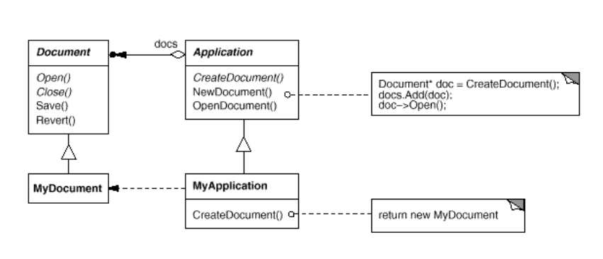

# Mydigital School (Rennes) Développement Natif - Module 3 : Dart (et POO)

Des exercices pour se familiariser avec le langage Dart et se rafraîchir la mémoire en programmation orientée objet et asynchrone.

- [Mydigital School (Rennes) Développement Natif - Module 3 : Dart (et POO)](#mydigital-school-rennes-développement-natif---module-3--dart-et-poo)
  - [Exercice 0 : Manipuler les types et les opérateurs de base](#exercice-0--manipuler-les-types-et-les-opérateurs-de-base)
  - [Exercice 1 : *Functions, functions everywhere !*](#exercice-1--functions-functions-everywhere-)
  - [Exercice 2 : Un problème métier à résoudre (*aider la science*)](#exercice-2--un-problème-métier-à-résoudre-aider-la-science)
  - [Exercice 3 : Héritage simple](#exercice-3--héritage-simple)
  - [Exercice 4 : Les problématiques liées à l'héritage](#exercice-4--les-problématiques-liées-à-lhéritage)
  - [Exercice 5 : Programmer vers des interfaces (Design Pattern)](#exercice-5--programmer-vers-des-interfaces-design-pattern)
  - [Exercice 6 : Préférer la composition à l'héritage](#exercice-6--préférer-la-composition-à-lhéritage)
  - [Exercice 7 : Fabriquer un petit interpréteur](#exercice-7--fabriquer-un-petit-interpréteur)
  - [Exercice 8 : Design pattern *Observer*](#exercice-8--design-pattern-observer)
  - [Exercice 9 : Tooling : génération de documentation, tests unitaires](#exercice-9--tooling--génération-de-documentation-tests-unitaires)
  - [Exercice 10 : Programmation asynchrone](#exercice-10--programmation-asynchrone)
  - [Exercice 11 : Simulation d'une colonie de fourmis](#exercice-11--simulation-dune-colonie-de-fourmis)
  - [Exercice 12 : Coder le jeu de la vie](#exercice-12--coder-le-jeu-de-la-vie)
    - [Règles et définitions](#règles-et-définitions)
    - [Objectifs](#objectifs)
    - [Exemple de départ](#exemple-de-départ)
  - [Exercice 13 : Implémenter l'algorithme de recherche de chemin A\* en Dart](#exercice-13--implémenter-lalgorithme-de-recherche-de-chemin-a-en-dart)
    - [Objectifs](#objectifs-1)
    - [Exemple de départ](#exemple-de-départ-1)
  - [Exercices supplémentaires](#exercices-supplémentaires)
  - [Liens utiles](#liens-utiles)

*Créer un fichier de code source par exercice (exercice0.dart, exercice1.dart, etc.)*

## Exercice 0 : Manipuler les types et les opérateurs de base

> Notions abordées: type primitifs, opérateurs, manipulation des chaines de caractères, comparateur, Map

1. **Déclarer** une variable `number` de type `int` et lui assigner la valeur 42.
2. Que vaut `number/5` ? Quel est son type ?
3. **Déclarer** une variable `text` de type `String` et lui assigner la valeur "Quelle est votre réponse ?".
4. **Convertir** number en `double` et préserver le résultat dans une nouvelle variable `decimalNumber`.
5. **Concaténer** `text` avec le représentation en chaîne de caractères de `decimalNumber` et le préserver dans une nouvelle variable `combinedText`
6. **Afficher** la *valeur* et le *type* de chaque variable en utilisant la fonction `print`. Sortie attendue :

~~~bash
Number: 42 (Type: int)
Text: Quelle est votre réponse ? (Type: String)
Decimal: 42.0 (Type: double)
CombinedText Text: Quelle est votre réponse ? 42.0 (Type: String)
~~~

6. **Afficher** le reste de la division `number` par 11.
7. **Afficher** la *division entière* de `number` par 11.
8. **Afficher** le résultat de la division de `number` par 11 avec une *précision* de 3 (trois chiffres significatifs).
9. **Afficher** `combinedText` avec tous les caractères alphabétiques en majuscules (`QUELLE EST VOTRE RÉPONSE ? 42.0`) et la taille de la chaîne. **Afficher** uniquement la réponse à la question (chaîne derriere le point d'interrogation).
10. **Créer** une liste de nombres contenant 10 nombres aléatoires, entre 1 et 50. **Faire** une copie de la liste. A l'aide d'un `assert`, **vérifier** que les deux listes sont identiques (même *valeur*). Calculer la moyenne et la médiane de la série. *Conseil: utiliser la classe `Rand` du paquet `dart:math`. Vos calculs doivent fonctionner même lorsque la série ne contient qu'une valeur*.

> Rappel : [la médiane](https://fr.wikipedia.org/wiki/M%C3%A9diane_(statistiques)) est la valeur qui sépare la moitié inférieure et la moitié supérieure des termes d'une série. Par exemple, dans la série [12, 5, 6, 89, 5, 2390, 1] la médiane est 6 (3 nombres en dessous de 6, 3 nombres au dessus)

11. **Créer** une chaîne de caractère contenant des adresses emails
~~~bash
randomemail1@example.com, emailaddress2@gmail.com, user3@hotmail.com, myemail4@yahoo.com, randomuser5@outlook.com, email6@gmail.com, user7@yahoo.com, myemailaddress8@hotmail.com, randomuser9@outlook.com, email10@yahoo.com
~~~
Transformer cette chaîne en liste. **Extraire** le nom de serveur (partie hôte) de ces données, puis **réaliser** des statistiques sur les occurrences de chaque fournisseur d'accès. Sortie attendue :

~~~bash
L'hôte example.com apparaît 1 fois sur 10
L'hôte gmail.com apparaît 2 fois sur 10
L'hôte hotmail.com apparaît 2 fois sur 10
L'hôte yahoo.com apparaît 3 fois sur 10
L'hôte outlook.com apparaît 2 fois sur 10
~~~

12.  Voici une liste de mots : `Cat, Sunshine, Bicycle, Fish, Harmony, Dart, Pillow, Atmosphere, Whisper, Chocolate, Adventure`. A l'aide d'une liste, trier les par taille du plus petit au plus grand. **Bonus :** tout en conservant l’ordonnancement par taille, ajouter un tri alphabétique. Par exemple, `Dart` doit apparaître avant `Fish`.

## Exercice 1 : *Functions, functions everywhere !*

> Notions abordées: écriture de fonctions, fonctions anonymes, typage, conventions Dart, random, first-citizen functions, récursivité, types composés, manipulation des dates et des timezone, test léger avec assert, List, Map

Écrire les fonctions qui réalisent les tâches suivantes :

1. Une fonction qui prend en argument une liste de nombres et retourne le nombre le plus grand.
2. Une fonction *récursive* qui effectue la somme d'une liste de nombres.
3. Une fonction `sumInRange` qui prend en argument une liste d'entiers et deux entiers `a` et `b`, avec `a < b`. Cette fonction doit retourner la somme des nombres de la liste compris entre `a` et `b` (inclus). Par exemple, si on fournit la liste `[1, 2, 3, 4]`, `a=1`, `b=3`, la fonction doit renvoyer la somme de liste filtrée `[1, 2, 3]`, soit `6`. 
4. On aimerait *généraliser* la fonction `sumInRange`. **Réécrire** la fonction précédente que l'on appellera `applyOnRange` de sorte à ce que l'on puisse lui *passer en argument une fonction f* afin de changer la nature de l'opération réalisée sur la sélection de nombres (actuellement la *somme*). Tester votre fonction en lui passant en paramètre une fonction anonyme qui calcule le *produit de tous les nombres*, et une fonction anonyme qui calcule *la somme des carrés*.
5. Une fonction qui renvoie vrai si une chaîne de caractères est un palindrome, faux sinon. Tester votre fonction avec le palindrome `"Engage le jeu que je le gagne"`.
6. Une fonction qui prend en paramètre un entier positif inférieur à 100, tire aléatoirement des entiers inférieurs à 100 jusqu'à tirer la valeur passée en paramètre et retourne le nombre d'essais.
7. Une fonction qui calcule votre âge (en secondes) à l'instant actuel, à la seconde près. Affichage attendu `"1 303 236 963 secondes vécues"`.
8. Une fonction qui répond à la question suivante : à quel jour de la semaine correspondait le 9 novembre 1989 ? **Bonus:** Afficher le résultat **en français**. *Conseil : utiliser le paquet `intl` pour accéder aux options d'internationalisation.*
9. Une fonction qui affiche l'heure courante (heure et minute) à Paris, Londres et Sydney. *Conseil : utiliser le paquet `timezone` pour accéder à la base des données de timezone. Les noms des timezone de Paris, Londres et Sydney sont respectivement 'Europe/Paris', 'Europe/London' et 'Australia/Sydney'.*

~~~dart
//La librairie des timezones
import 'package:timezone/timezone.dart' as tz;
//La base de données des timezones
import 'package:timezone/data/latest.dart' as tz;

void main() {
  //Initialiser la base
  tz.initializeTimeZones();
  var locations = tz.timeZoneDatabase.locations;
  print(locations.length); // => 431 timezones dans la base
}

~~~

10. *Fizzbuzz*, avant d'être utilisé par les recruteur·euses pour faire passer des tests techniques, est un jeu pour apprendre la division aux enfants. Les règles sont simples : il faut compter jusqu'à un certain nombre *positif* qu'on se fixe à l'avance : si le nombre est divisible par 3 on le remplace par `"Fizz"`, si il est divisible par 5 par `"Buzz"`, s'il est divisible par 3 et 5, comme 15, par `"Fizz Buzz"`. Sinon on se contente de dire le nombre. **Écrire** la fonction `String fizzbuzzIterative(int n)` qui retourne la réponse du jeu sous forme de chaîne de caractère, où `n` représente la taille du jeu. Par exemple, `fizzbuzzIterative(15)` retournera `"1 2 Fizz 4 Buzz Fizz 7 8 Fizz Buzz 11 Fizz 13 14 Fizz Buzz"`. **Réécrire** la fonction de manière *récursive* (sans structure de contrôle de boucle). **Écrire un test** (avec `assert`) qui permet de s'assurer que les deux fonctions renvoient bien la même réponse. Est-ce que ce test est suffisant pour avoir confiance en nos implémentations ?
11. Une fonction qui prend en argument une `Map` représentant des personnes (nom de famille, date de naissance). On se servira du *nom* comme clé. La fonction doit retourner la *liste* des noms des personnes nées *en hiver* (l'hiver selon la France). Voici un jeu de données test (prénom, nom, date de naissance) :

~~~bash
John Doe - 1990 01 05
Jane Smith - 1985 03 12
Emily Davis - 1992 03 20
David Wilson - 1982 07 03
Jessica Anderson - 1998 06 08
Christopher Martinez - 1987 10 17
Olivia Thompson - 1991 12 21
~~~

Que se passe-t-il si on ajoute cette nouvelle entrée dans la map : `David Wilson - 1973 01 24` ? Pourquoi ?

> Attention, **aucune des fonctions** ne doit avoir d'*effets de bord* ! (comme modifier la liste passée en argument par exemple)

12. Une fonction `chooseOperation` qui prend en argument deux entiers `a` et `b`. Si `a` > `b`, la fonction doit retourner une fonction qui effectue le produit deux nombres (`num`), une fonction qui effectue la division entière de deux nombres sinon. La fonction retourne alors le résultat sous forme de chaîne de caractères. Quelle est la signature *complète*  de la fonction `chooseOperation` (avec annotation de type) ?

13. Une fonction `deriv` qui retourne la *dérivée* d'une fonction `f` mathématique à une seule variable. On rappelle que la dérivée d'une fonction en un point x est définie par `(f(x+dx)-f(x)/dx)` avec `dx << 1`. On prendra `dx=0.000001`. Évaluer la fonction qui à x associe x³ en `x=2` et sa dérivée au même point.

<!-- 
Trouver des exercices cools sur Codewars
 -->

## Exercice 2 : Un problème métier à résoudre (*aider la science*)

> Notions abordées : écriture de fonctions, design, modularité, lire et écrire depuis/sur la sortie standard, manipulation de fichiers, arguments du programme, format csv, exception

Vous travaillez dans un laboratoire de mécanique et vous devez écrire un programme pour calculer les volumes de différents tuyaux de forme cylindrique utilisés dans des expériences d'écoulement de fluides. 

> Remarque: nous travaillerons avec des unités arbitraires.

1. **Écrire** une fonction `computeCylinderVolume` qui permet de calculer le volume d'un cylindre. Nous rappelons que le volume d'un cylindre de rayon r et de hauteur h est donné par `pi*r²*h`. pi est donnée par l’expression suivante : `pi = 4 * atan(1.0)`. Utilisez votre fonction pour calculer le volume total des cylindres ayant les dimensions suivantes : 
   1. radius=1,height=3
   2. radius=5,height=7

On utilisera un [record](https://dart.dev/language/records) pour stocker les données de chaque cylindre.

2. Une série d'expériences importantes est en cours de préparation au laboratoire, et seuls des tuyaux ayant un volume supérieur à `450 unités` et un rayon supérieur à `7 unités` peuvent être utilisés pour la réaliser. 

Le laboratoire possède de nombreux tuyaux en stock mais il doit savoir s'il doit en acheter d'autres ou non. Vous devez écrire un programme qui permet de "filtrer les cylindres" afin de réaliser l'inventaire des tuyaux utilisables. Le programme doit permettre de renseigner les dimensions d'un tuyau présent dans le laboratoire et indiquer s'il est utilisable pour l'expérience ou non. Si c'est le cas, il affichera un message de la forme `Cylindre accepté (Rayon: <radius>, Hauteur: <hauteur>, Volume : <volume>)`, `Cylindre rejeté (Rayon: <radius>, Hauteur: <hauteur>, Volume : <volume>)` sinon. 

~~~bash
#Exemple de sortie attendue
Cylindre rejeté      : (Rayon : 1.00, Hauteur : 3.00, Volume : 9.42))
Cylindre accepté     : (Rayon : 8.00, Hauteur : 7.00, Volume : 1407.43))
Cylindre rejeté      : (Rayon : 7.00, Hauteur : 7.00, Volume : 1077.57))
Cylindre accepté     : (Rayon : 7.10, Hauteur : 7.00, Volume : 1108.57))
Cylindre rejeté      : (Rayon : 7.10, Hauteur : 2.50, Volume : 395.92))
~~~

**Décomposer** le problème à résoudre en sous problèmes puis en fonctions. Implémenter chaque fonction en respectant les conventions du langage Dart (annotation de type, nommage). Le programme doit permettre de renseigner les dimensions du cylindre via l'entrée standard (`stdin`). Penser à gérer le cas de mauvais inputs utilisateurs avec le mécanisme d'exceptions. *Conseil : utiliser le paquet `dart:io`*

3. **Bonus :** On aimerait améliorer l'interface utilisateur du programme en pouvant importer un fichier contenant une liste de cylindre au [format CSV](https://fr.wikipedia.org/wiki/Comma-separated_values). Les cylindres acceptés seront affichés sur la sortie standard. **Ajouter** cette fonctionnalité au programme. Pour y parvenir, passer le fichier CSV en argument du programme `dart run <votre programme> cylinders.csv`. Si on fournit un (*et un seul*) fichier dans le répertoire courant avec l'extension `.csv` en argument au programme, il utilise le fichier CSV, imprime le rapport comme précédemment sinon il reste interactif et demande les inputs à l'utilisateur comme précédemment. *Indice: [regarder cette page de la documentation](https://dart.dev/tutorials/server/cmdline). Vous voudrez également installer et utiliser les paquets [csv](https://pub.dev/packages/csv/install) et [path](https://pub.dev/packages/path)*
   
Un fichier CSV d'exemple

~~~csv
#radius,height
4,120
20,23
3,4
7,2.50
8,7
-1.2,45
3,5
~~~

Sortie attendue

~~~bash
dart run --enable-asserts exercice2.dart cylinders.csv
Chargement d'un fichier CSV contenant les données au format radius, height
Cylindre rejeté      : (Rayon : 4.00, Hauteur : 120.00, Volume : 6031.86))
Cylindre accepté     : (Rayon : 20.00, Hauteur : 23.00, Volume : 28902.65))
Cylindre rejeté      : (Rayon : 3.00, Hauteur : 4.00, Volume : 113.10))
Cylindre rejeté      : (Rayon : 7.00, Hauteur : 2.50, Volume : 384.85))
Cylindre accepté     : (Rayon : 8.00, Hauteur : 7.00, Volume : 1407.43))
~~~

## Exercice 3 : Héritage simple

> Notions abordées : programmation orientée objet, héritage simple, constructeurs, super, variables de classe, visibilité, immutabilité

1. Dans un fichier `main.dart`, **créer** une classe `City` représentant une ville avec les attributs `name` et `county` (département). Instancier trois villes avec les données fournies ci-dessous.
2. **Déplacer** la définition de `City` dans un fichier `city.dart`. Dans votre code client (fichier `main.dart`), **importer** la classe. [**Surcharger** la méthode de classe](https://dart.dev/language/extend#overriding-members) d'affichage pour **imprimer** une ville sur la sortie standard sous la forme "X se situe dans le département Y". 
3. Dans le fichier `city.dart`, **créer** une classe nommée `CityWithArea` (*area* désigne la région) qui étend la classe `City` affichant « La ville X se situe dans le département Y de la région Z ». 
4. **Modifier** la classe `City` pour que l'on puisse connaître la ville ayant le nom le plus long parmi toutes celles instanciées, avec une variable `longestCityName`. Cette variable ne doit pas être modifiable dans le code client (`main.dart`).

> Données du problème à utiliser au format (Ville, Département, Région) : (Rennes, Ille-et-Vilaine, Bretagne), (Saint-Brevin-les-Pins,  Loire-Atlantique, Pays de la Loire), (Plescop, Morbihan, Bretagne)

## Exercice 4 : Les problématiques liées à l'héritage

> Notions abordées : héritage, interface

>Cet exercice est un *classique* de la POO, on verra pourquoi. 

On veut créer un programme qui manipule des formes géométriques.

1. Créer une classe `Rectangle`, et implémenter un getter `area` qui retourne son aire. **Implémenter** sa méthode `toString` pour afficher ses dimensions et son aire `width=$width, height=$height, area=$area`

>L'utilisateur de la classe doit pouvoir créer des objets avec les dimensions qu'il désire.

On souhaite à présent créer une classe `Square` qui étend `Rectangle` (un carré *est juste* un cas particulier de rectangle). 

2. **Implémenter** la classe `Square` et son getter `area`.
3. **Créer** une collection composée d'un rectangle de largeur 1 et hauteur 2, et de un carré de côté 1. Afficher l'aire de chacun d'entre eux.
4. **Implémenter** un *setter* ` increaseWidthBy(int percent)` de sorte que l'on puisse augmenter la largeur d'un rectangle de `percent`%. Faire de même avec un *setter* `void increaseHeightBy(int percent)` pour augmenter sa hauteur.
5. Pour chaque item de la collection, **augmenter** la largeur de `100%` puis afficher les.
6. Qu'observez-vous ? Quel est le problème ? Comment le régler ? **Imaginer** des solutions avec l'héritage.
7. **Proposer** une solution alternative au problème *sans utiliser l'héritage*.

## Exercice 5 : Programmer vers des interfaces (Design Pattern)

> Notions abordées : interface, design pattern factory, poo

On se propose de réaliser un mini framework qui permet de faire des `Application`s pouvant présenter à l'écran différents types de `Document`. Un document doit pouvoir être *ouvert*, *fermé*, sauvé* et modifié*. 

>L'implémentation des méthodes correspondantes pour `open`, `close`, `save` ou `modify` de `Document` ne sont pas demandées, un simple message sur la sortie standard du type `'Le document est ouvert en lecture et en écriture'` pour la méthode `open()` est suffisant, etc. Vous pouvez toujours implémenter une solution complète si vous avez le temps ou si cela vous intéresse.

Ci-dessous vous est présenté un diagramme UML du projet. Le framework met à disposition les classes `Application` et `Document`. Un·e utilisateur·rice du framework peut ensuite définir une classe `MyApplication` de type Application et `MyDocument` de type Document, et réaliser ainsi son propre projet.

1. Créer les classes `Application` et `Document` mises à disposition par le framework.
2. **Proposer** une *implémentation* de ce framework et **implémenter** deux applications: `ApplicationImage` qui manipule un document `Image` et `ApplicationText` qui manipule un document `Texte`.

3. Pour le document image `DocumentImage`, **implémenter une solution demandant** à l'utilisateur de rentrer les coordonnées de l'image (afficher juste un message sur la sortie standard) *avant* de créer le document.

>Indication: Le framework ne peut pas savoir à l'avance quel document il va manipuler (cela peut être un document image, un document texte, etc.)

## Exercice 6 : Préférer la composition à l'héritage

> Notions abordées : composition, design pattern, poo

Nous disposons d'une application avec une classe `HtmlDocument` qui représente n'importe quel document HTML. Voici le code de la classe

~~~dart
class HtmlDocument{
    String getHtml(){
        return sprintf("<html><body>%s</body></html>", getContent());
    }
    String getContent(){
       return 'Hello !';
    }
}
~~~

1. En utilisant l'héritage, **créer** une classe enfant `HelloMessage` qui permet d'afficher `"Hello, {un message} !"` dans un document HTML.
2. De la même manière, **créer** une classe `Announcement` qui permet d'afficher le message `"Annonce importante !"` dans une balise `
`, dans un document HTML.

On voudrait à présent pouvoir fabriquer des documents HTML avec n'importe quel type de contenu. Le problème c'est qu'en utilisant l'héritage nous devons créer autant de classes enfants qu'il y a de type de contenus. Pour y remédier nous utilisons [le pattern *Strategy*](https://refactoring.guru/fr/design-patterns/strategy).

3. **Identifier** ce qui varie dans le code et isoler-le dans une Interface `HtmlContentStrategy`.
4. **Réimplémenter** les classes (vos stratégies) `HelloMessage` et `Annoucement` en utilisant cette interface.
5. **Instancier** un `HtmlDocument` avec une stratégie `HelloMessage` et afficher le document HTML sur la sortie standard. Faites de même avec la stratégie `Announcement`.
6. **Dessiner** le diagramme UML de votre solution.
7. Qu'avons-nous gagné en passant d'une solution sous forme d'héritage à une solution *Strategy* ?

## Exercice 7 : Fabriquer un petit interpréteur

> Notions abordées : récursivité, gestion inputs utilisateurs, algorithmie, exceptions

**Écrire** un mini interpréteur capable de lire une expression en entrée et retourner le résultat de l'évaluation de cette expression. Le programme doit pouvoir évaluer les expressions utilisant la notation préfixée (ou notation polonaise préfixée). Dans cette notation, les opérateurs sont placés *avant* leurs opérandes. Par exemple, l'expression mathématiques traditionnelle d'addition `3 + 4` est écrite `+ 3 4`. De la même manière, l'expression `5 * (2 + 7)` est écrite `* 5 (+ 2 7)`. On écrira chaque expression entre parenthèses, sous forme de liste, avec *l'opérateur placé en premier argument de la liste*. Par exemple `(+ 3 4)` est évalué à 7, `(* 5 (+ 2 7))` est évalué à 35. Pour évaluer une expression, il faut commencer par évaluer la liste la plus imbriquée pour la remplacer par sa valeur et ainsi de suite.

Voici un exemple de l'utilisation du programme `interpreter`

~~~bash
./interpreter (* 5 (+ 2 (/ 9 3)))
25
~~~

Le programme devra vérifier que l'expression à évaluer est *bien formée* et que l'opérateur existe. Si ce n'est pas le cas, il devra afficher une erreur

~~~bash
#Il manque une parenthèse
./interpreter (* 5 (+ 2 (/ 9 3))
Erreur de syntaxe ! Merci de corriger votre expression
~~~

L'interpréteur supporte les opérateurs suivants :

- `+` pour l'addition
- `-` pour la soustraction
- `/` pour la division
- `*` pour la multiplication
- `modulo` pour le reste de la division entière

> Pour vous familiariser avec cette notation, vous pouvez utiliser [l’interpréteur en ligne de Scheme](https://inst.eecs.berkeley.edu/~cs61a/fa14/assets/interpreter/scheme.html), un dialecte de Lisp

## Exercice 8 : Design pattern *Observer*

> Notions abordées : gestion inputs utilisateurs, design pattern Observer, poo, manipulation de fichiers, json, xml

1. **Créer** un programme `list` capable de représenter des personnes. Chaque personne à un nom de famille et une date de naissance. Le programme, une fois exécuté, attend un input utilisateur. L'utilisateur renseigne un nombre. Lorsqu'il le reçoit, le programme doit afficher toutes les personnes ayant un âge supérieur à ce nombre et les classer du plus jeune au plus âgé. Pour réaliser ce programme, [implémenter le pattern Observer](https://refactoring.guru/fr/design-patterns/observer).

Soit Foo, Bar et Baz, trois personnes nées respectivement le 17/03/1978, 25/02/2002 et le 27/11/2014. Voici le résultat attendu par le programme

~~~bash
./list 18
Bar
Foo 
~~~

2. Si l'input utilisateur est une chaîne de caractère, le programme doit afficher toutes les personnes dont le nom commence par la chaîne de caractère et les classer par ordre alphabétique. Il ne doit pas être sensible à la casse.

3. **Bonus** : **Imprimer** la liste générée dans deux fichiers `list.json` et `list.xml`, sauf si la liste est vide.

~~~bash
./list b
~~~

Sortie attendue :

~~~json
//list.json
[
    {
        "name": "Bar",
        "birthDate": "25/02/2002"
    },
     {
        "name": "Baz",
        "birthDate": "27/11/2014"
    }
]
~~~

~~~xml
<!-- list.xml -->
<?xml version="1.0" encoding="UTF-8"?>
<results>
    <person birthDate="25/02/2002">
      <name>Bar</name>
    </person>
    <person birthDate="27/11/2014">
      <name>Baz</name>
    </person>
</results>
~~~

## Exercice 9 : Tooling : génération de documentation, tests unitaires

1. **Créer** un projet dart et y déplacer toutes les fonctions de l'exercice 1.
2. A l'aide des outils intégrés, **générer** la documentation du code source de l'exercice 1 (`exercice1.dart`) pour les fonctions 1. [Respecter les recommandations officielles](https://dart.dev/effective-dart/documentation) pour la documentation
3. **Écrire** et exécuter des tests unitaires pour les fonctions 2, 3 et 5 de l'exercice 1 avec [le package test](https://pub.dev/packages/test)
4. **Régler** le compilateur de manière *stricte* avec les paramètres suivants : 

~~~yaml
analyzer:
  language:
    strict-casts: true
    strict-inference: true
    strict-raw-types: true
~~~

**Analyser** votre code avec `dart analyze`. **Corriger** les erreurs (warnings) s'il y'en a.

<!-- 
Voir une correction partielle [dans la démo](./code-source/dart-project-exercice-9/) 
dart doc
dart analyze
dart test
 -->

## Exercice 10 : Programmation asynchrone

> Notions abordées: programmation asynchrone (Future, async, await), client HTTP, json

1. Écrire un programme qui requête l'api [jsonplaceholder](https://jsonplaceholder.typicode.com) et récupère tous les commentaires d'un post (via son identifiant unique). **Afficher** la réponse sous forme de chaîne de caractères. Écrire le programme de manière à effectuer la requête de manière *asynchrone*. Le programme doit afficher `"Fetching data... Please wait a moment."` *pendant* que le traitement a lieu.
2. Une fois la réponse obtenue, **afficher** uniquement les emails des auteurs de chaque commentaire.
3. Le programme doit également travailler sur les `posts` d'un utilisateur. **Écrire** une nouvelle fonction asynchrone pour afficher le nombre de posts d'un l'utilisateur.
4. Une nouvelle requête doit être sur la ressource `/comment`, qui n'existe pas. **Écrire** la requête et *échouer avec grâce* en gérant l'erreur et en affichant `"The ressource was not found"`.
5. On souhaiterait à présent récupérer le nombre d'utilisateurs de notre application pour faire des statistiques. Afficher le résultat **directement dans la fonction `main`**.

> Indices : pour effectuer une requête HTTP en Dart, utiliser [le paquet http](https://pub.dev/packages/http). Installer le paquet avec `dart pub add http`. Pour parser des fichiers JSON, la fonction [jsonDecode](https://api.flutter.dev/flutter/dart-convert/jsonDecode.html) du paquet `'core:convert'`

<!-- 
Ecrire un programme client de l'API Swapi qui demande d'entrer un nombre entre 1 et 10 et requete l'url http https://swapi.dev/api/people/number et affiche le nom du personnage starwars.
 -->

## Exercice 11 : Simulation d'une colonie de fourmis

> Me demander le sujet

## Exercice 12 : Coder le jeu de la vie

[Le Jeu de la Vie](https://fr.wikipedia.org/wiki/Jeu_de_la_vie) est un automate cellulaire imaginé par le mathématicien britannique John Conway en 1970. Il se déroule sur une grille bidimensionnelle infinie et consiste en une simulation de l'évolution d'une population de cellules, chaque cellule pouvant être dans un état "vivant" ou "mort". Les règles du jeu déterminent l'évolution des cellules au fil des générations.

### Règles et définitions

- Une cellule vivante qui a 2 ou 3 voisins vivants reste vivante à la génération suivante.
- Une cellule vivante avec moins de 2 voisins vivants meurt par isolement.
- Une cellule vivante avec plus de 3 voisins vivants meurt de surpopulation.
- Une cellule morte avec exactement 3 voisins vivants devient vivante à la génération suivante.

### Objectifs

Votre tâche est d'implémenter le Jeu de la Vie en Dart. Vous devrez créer une grille bidimensionnelle représentant l'état des cellules et écrire un ensemble de fonctions pour évoluer la grille d'une génération à l'autre en suivant les règles du jeu. La grille sera affichée dans le terminal. Elle pourra être bi-périodique ou avec des limites.

### Exemple de départ

~~~dart
void main() {
  // Créez une instance de la grille et initialisez-la
  Grid gameOfLife = Grid();
  gameOfLife.initGrid(10, 10);

  // Évoluez la grille sur plusieurs générations
  for (int time = 0; time < 10; time++) {
    print("Generation $time:");
    gameOfLife.printGrid();
    gameOfLife.nextGeneration();
  }
}
~~~

## Exercice 13 : Implémenter l'algorithme de recherche de chemin A* en Dart

[L'algorithme A*](https://en.wikipedia.org/wiki/A*_search_algorithm) (prononcé "A-star") est un algorithme de recherche de chemin largement utilisé pour trouver le chemin le plus court entre deux points dans un graphe pondéré, tel qu'une carte ou un jeu vidéo. Il est utilisé dans de nombreux domaines, notamment la robotique, les jeux vidéo, et la planification de trajets.

### Objectifs

Votre tâche consiste à implémenter l'algorithme de recherche de chemin A* en Dart. Vous devrez créer une fonction qui prend en entrée une carte, des coordonnées de départ et d'arrivée, et retourne le chemin le plus court entre ces deux points.

### Exemple de départ

~~~dart
void main() {

  //Initialisation d'une carte avec des obstacles (1)
  List<List<int>> map = [
    [0, 0, 0, 1, 0],
    [0, 1, 0, 1, 0],
    [0, 1, 0, 0, 0],
    [0, 0, 0, 1, 0],
    [0, 0, 0, 0, 0],
  ];

  //Conditions initiales
  Point start = Point(0, 0);
  Point end = Point(4, 4);

  //Fonction à implémenter
  List<Point> path = findShortestPath(map, start, end);

  if (path.isNotEmpty) {
    print("Chemin trouvé : $path");
  } else {
    print("Aucun chemin trouvé.");
  }
}
~~~

> Voir [l'excellent blog Red Blob Games, d'Amit Patel](https://www.redblobgames.com/) sur les algorithmes, et notamment celui [sur A*](https://www.redblobgames.com/pathfinding/a-star/introduction.html)

## Exercices supplémentaires

 - [Codelabs Dart](https://dart.dev/codelabs)
 - [Des katas Dart sur Codewars](https://www.codewars.com/kata/search/dart?q=&r%5B%5D=-7&r%5B%5D=-6&r%5B%5D=-8&r%5B%5D=-5&tags=Fundamentals&beta=false&order_by=satisfaction_percent%20desc%2Ctotal_completed%20desc), choisissez des katas adaptés à votre niveau (le but est d'apprendre Dart). Vous devez vous créer un compte sur [codewars](https://www.codewars)
 - Demandez-moi !

## Liens utiles

- [Dart SDK](https://api.dart.dev/stable/3.1.1/index.html), Dart API reference documentation, la racine de la documentation du langage Dart
- [dart:core library ](https://api.dart.dev/stable/3.1.1/dart-core/dart-core-library.html), la documentation officielle de la core library de Dart
- [Dart : Commonly used packages](https://dart.dev/guides/libraries/useful-libraries), la liste des paquets les plus utilisés en dart (http, json, path, etc.)
- [Dart doc : List<E> class](https://api.dart.dev/stable/3.1.1/dart-core/List-class.html)
- [DateTime class ](https://api.dart.dev/stable/3.1.2/dart-core/DateTime-class.html)
- [DateFormat class ](https://api.flutter.dev/flutter/intl/DateFormat-class.html)
- [Design Pattern Stratégie](https://refactoring.guru/fr/design-patterns/strategy)
- [Design Pattern Factory](https://refactoring.guru/fr/design-patterns/factory-method)
- [Dart : Write command-line apps](https://dart.dev/tutorials/server/cmdline)